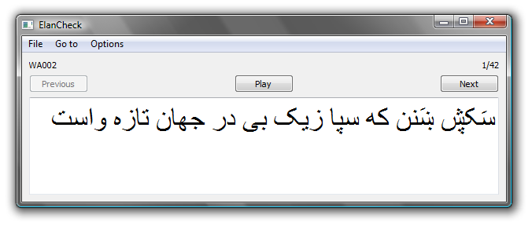

ElanCheck
------------

ElanCheck is a low-tech, no-expertise-required way to edit the transcriptions in Elan (.eaf) files. Using ElanCheck, a language helper can transcribe a segmented audio file, without having to confront the frightening Elan interface.



*   The basics:
    *   _File | Open_ Open a file
    *   _File | Save_ Save the file
    *   _File | Exit_ Exit the program
    *   You can double-click on an .eaf file and then tell Windows always to open them with ElanCheck.
*   Basic Editing
    *   _Play_ Plays the current annotation
    *   _Next_ Goes to the next annotation
    *   _Previous_ Goes to the previous annotation
    *   Edit the text in the box to change the annotation value
*   Navigation
    *   _Go to | First_ Go to the first annotation
    *   _Go to | Last_ Go to the last annotation
    *   _Go to | Go to..._ Enter which annotation you want to go to
*   Options
    *   Elan stores both relative and absolute paths. My thought it is that it makes most sense to check for the relative path, then the absolute. But you can change this behavior under the _Paths_ submenu.
    *   _File | Font..._ Sets the font for the annotation editor.
    *   Using _Tiers_ you can select which annotation tier to edit (if there are more than one in your file).
*   Flagging
    *   You can flag an annotation for review with _Options | Flag_. (This is intentionally placed in an out-of-the-way place so that a language helper won't bother about it.)
    *   When you open a file with flags, the default is that only the flagged annotations are shown, so that you or your language helper can review those. If you want to see all of the annotations, do _Options | Flags | Show all_. (Or switch back to flags-only with _Options | Flags | Show flagged_.)
    *   Using _Tiers_ you can select which annotation tier to edit (if there are more than one in your file).
    *   Flagging is not an Elan feature; Elan Check adds it in on its own. Elan can still open these files, but if you save them in Elan, the flags will all be lost.
*   Caveats
    *   Elan check doesn't remember your options after you close the program.
    *   Only WAV files are supported
    *   As a corrolary to the above, there is no support for video.
    *   (For programmers) The code is quite a mess: no comments to speak of, and the methods aren't even sorted.

Downloads
---------

ElanCheck is created with the [Qt application framework](https://www.qt.io/), released under the GNU Public License. That means, among other things, that you are free to download it and use it, but not to re-sell it.

Qt is a cross-platform framework, so there is the possibility for using this on Mac OS X, Linux, etc. Right now I only have Windows executables because I only have a Windows machine. Perhaps some do-gooder will build versions for other operating systems and send them to me.

I build in Windows with this, which assumes that Qt is installed and visible in your path:

```
qmake -config release
mingw32-make
```

Of course your system would have something different from “mingw32-make”—probably just “make”—if you are not building from Windows using MinGW.
